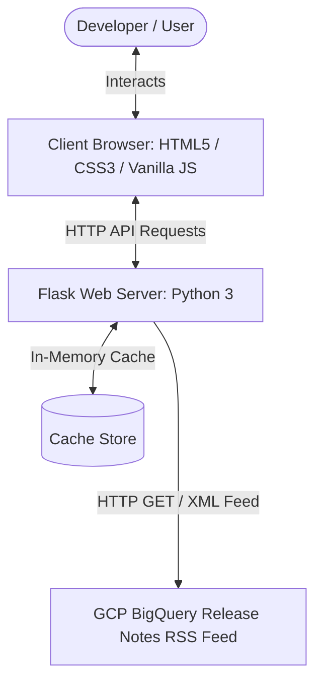
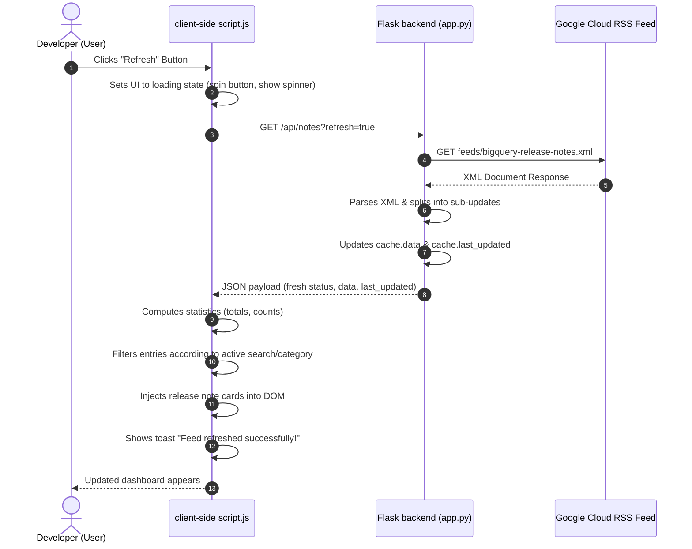
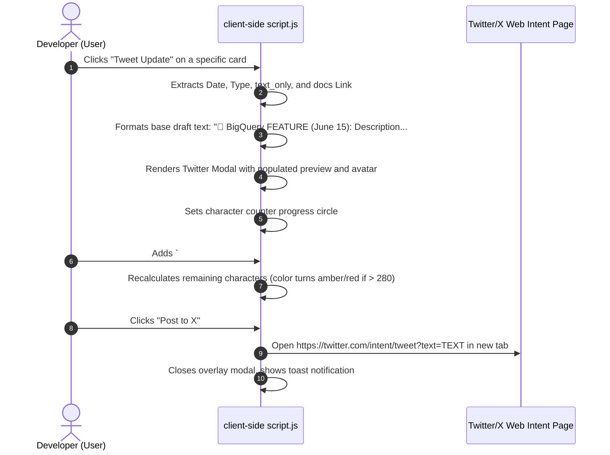

# BigQuery Release Pulse: Architecture & Technical Walkthrough

This architectural guide details the server and client-side mechanics of the **BigQuery Release Pulse** web application. It breaks down the application's components, documents the code logic inside [app.py](file:///C:/Users/divya/OneDrive/Desktop/Learn/AI/Agent%20AI/Google%205Day%20Intensive%20Vibe%20Coding/5Day_AI_Agents_Intensive_Vibe_Coding_Course_With_Google/Day2/agy-cli-projects/bigquery-release-viewer/app.py), and traces request-response flows.

---

## 🗺️ System Overview

The app is built as a lightweight, high-performance web dashboard. It acts as an intermediary parser that transforms a standard Google Cloud RSS/Atom feed into a structured, searchable, and interactive developer dashboard.



---

## 🛠️ Main Features

1. **Intelligent RSS Segmenting**: Standard Atom entries pool multiple updates together by date. The server splits dates into individual updates (e.g. splitting June 15th's announcements from its features) for granular readability and sharing.
2. **Real-time Frontend Filtering & Search**: Features, announcements, deprecations, and fixes are indexed and filtered instantly inside the client browser without additional server round-trips.
3. **Interactive X/Twitter Composer Modal**: A custom mockup composer allowing text editing, character constraint safety warnings, and tag selection before publishing directly to X via Twitter Intents.
4. **Fast Cache Layer**: Mitigates rate limits or slow connections to Google Cloud Docs by maintaining a 30-minute in-memory cache, while supporting a force-refresh trigger.

---

## 💾 Server-Side Architecture (Backend)

The backend is built with Python Flask and is completely self-contained in [app.py](file:///C:/Users/divya/OneDrive/Desktop/Learn/AI/Agent%20AI/Google%205Day%20Intensive%20Vibe%20Coding/5Day_AI_Agents_Intensive_Vibe_Coding_Course_With_Google/Day2/agy-cli-projects/bigquery-release-viewer/app.py).

### Detailed Breakdown of [app.py](file:///C:/Users/divya/OneDrive/Desktop/Learn/AI/Agent%20AI/Google%205Day%20Intensive%20Vibe%20Coding/5Day_AI_Agents_Intensive_Vibe_Coding_Course_With_Google/Day2/agy-cli-projects/bigquery-release-viewer/app.py)

#### 1. Core Config & Namespaces
```python
FEED_URL = "https://docs.cloud.google.com/feeds/bigquery-release-notes.xml"
ns = {'atom': 'http://www.w3.org/2005/Atom'}
```
Atom XML feeds use the namespace `http://www.w3.org/2005/Atom`. By defining a mapping (`ns`), we can target elements (like `atom:entry` or `atom:title`) using standard Python `ElementTree` xpath searches.

#### 2. HTML Helper Functions
* **`strip_html_tags(html_str)`**: Uses the regular expression `<.*?>` to replace HTML elements with spaces, then condenses multiple spaces and newlines down into single spaces. This processes raw HTML descriptions into plain text strings, which are then passed to Twitter.
* **`fix_relative_links(html)`**: Regular expression lookahead replacing `href="/...` with `href="https://cloud.google.com/...` so that any relative links inside Google's release notes resolve correctly on the client side.

#### 3. XML Parser: `parse_feed()` & `parse_content_html()`
The parser performs a dual-layer extraction:
* **Layer 1 (`parse_feed`)**: Downloads the XML using the `requests` library. It loops over every `<entry>` to extract the publication date (like "June 16, 2026") and the canonical documentation link.
* **Layer 2 (`parse_content_html`)**: 
  - Atom feeds store documentation in a single CDATA block per day. 
  - To isolate individual items, the app uses a regex pattern: `re.compile(r'<h3>(.*?)</h3>(.*?)(?=<h3>|$)', re.DOTALL | re.IGNORECASE)`.
  - This matches `<h3>Type</h3>` headings (such as "Feature" or "Issue") and captures all proceeding HTML description content *up to* the next `<h3>` heading or the end of the entry block.
  - It generates a unique ID for each update (e.g., `June_15_2026_feature_2`) which helps track user interactions and allows developers to anchor links directly.

#### 4. Cache & Routes
* **`cache = {'data': None, 'last_updated': 0}`**: Prevents hammering GCP on every client load. If the data is requested within 30 minutes, Flask serves it instantly from memory.
* **`/api/notes` route**: 
  - Reads the query parameter `refresh`. If `refresh=true`, it skips the cache lookup, initiates a fresh GET request, updates the memory store, and returns the payload.
  - If a fresh fetch fails, it gracefully falls back to the existing cache data (`cached_fallback` state).

---

## 🎨 Client-Side Architecture (Frontend)

The frontend is constructed using HTML5 semantic elements, vanilla CSS3 styling, and modern responsive ES6 JavaScript.

### Core Components
* **HTML Structure ([index.html](file:///C:/Users/divya/OneDrive/Desktop/Learn/AI/Agent%20AI/Google%205Day%20Intensive%20Vibe%20Coding/5Day_AI_Agents_Intensive_Vibe_Coding_Course_With_Google/Day2/agy-cli-projects/bigquery-release-viewer/templates/index.html))**: Divides the layout into a grid: left control sidebar (search, category filter, date timeline) and right timeline feed stream. Injected with particle-stars containers for rich aesthetics.
* **Visual Aesthetics ([style.css](file:///C:/Users/divya/OneDrive/Desktop/Learn/AI/Agent%20AI/Google%205Day%20Intensive%20Vibe%20Coding/5Day_AI_Agents_Intensive_Vibe_Coding_Course_With_Google/Day2/agy-cli-projects/bigquery-release-viewer/static/style.css))**:
  - CSS custom properties (variables) for HSL color tokens.
  - Glassmorphic panels with border overlays (`border: 1px solid rgba(255, 255, 255, 0.07)`) and background blurs (`backdrop-filter: blur(16px)`).
  - Twinkle animations for star particles using keyframe shifts.
  - Responsive media query configurations (rescaling to 1-column layouts on tablets/mobile).
* **Interactive Engine ([script.js](file:///C:/Users/divya/OneDrive/Desktop/Learn/AI/Agent%20AI/Google%205Day%20Intensive%20Vibe%20Coding/5Day_AI_Agents_Intensive_Vibe_Coding_Course_With_Google/Day2/agy-cli-projects/bigquery-release-viewer/static/script.js))**:
  - **State Store**: Holds a copy of `releaseNotes` and a working array `filteredNotes`.
  - **Reactivity**: Any keypress in the search bar or tab filter change updates the state tracking object (`activeFilters`) and triggers `applyFilters() -> renderNotes()`, which updates the DOM.
  - **Copy Actions**: Writes text content directly to clipboard via browser `navigator.clipboard.writeText()` and triggers temporary status notifications (toast).

---

## 🔄 Sample Request-Response Flow

### Flow 1: Click "Refresh" Button
The following sequence details how the system requests, parses, and displays fresh data:



### Flow 2: Tweet Composer Flow
The following sequence outlines how the custom Tweet composer and previewer functions:


